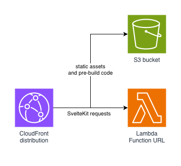

# kit-on-lambda

[](https://www.npmjs.com/package/kit-on-lambda)
[](./LICENSE)

SvelteKit adapter for AWS Lambda — deploy to Node.js or Bun runtimes, bundled with esbuild or Bun, behind CloudFront.

Supports three deployment configurations:

| Option | Build tool | Lambda runtime |
|--------|------------|----------------|
| 1 (default) | esbuild | Node.js |
| 2 | Bun | Bun (custom layer) |
| 3 | Bun | Node.js |

## Installation

```bash
npm i kit-on-lambda aws-cdk aws-cdk-lib constructs
# or
bun i kit-on-lambda aws-cdk aws-cdk-lib constructs
```

To access the raw AWS event and context from inside your SvelteKit handlers, also install:

```bash
npm i @beesolve/lambda-fetch-api
# or
bun i @beesolve/lambda-fetch-api
```

## Architecture

SvelteKit is deployed to AWS Lambda behind CloudFront. Static assets are served from an S3 bucket.



## Option 1 — build with esbuild, run on Node.js runtime

The default adapter. Uses esbuild to bundle the server and deploys to the official Node.js Lambda runtime.

```ts
// svelte.config.js
import { vitePreprocess } from "@sveltejs/vite-plugin-svelte";
import adapter from "kit-on-lambda";

const originUrl = "https://{distributionId}.cloudfront.net";

/** @type {import('@sveltejs/kit').Config} */
const config = {
  preprocess: vitePreprocess(),
  kit: {
    adapter: adapter(),
    paths: {
      assets: originUrl,
    },
    csrf: {
      trustedOrigins: [originUrl],
    },
  },
};

export default config;
```

> [!NOTE]
> Set `kit.paths.assets` and `kit.csrf.trustedOrigins` to your CloudFront distribution URL.

```ts
// app.ts
import { SvelteKit } from "kit-on-lambda/cdk";
import { App, Stack, type Environment } from "aws-cdk-lib";

const env: Environment = {
  account: "your-account-id",
  region: "your-preferred-region",
};

const app = new App();
const stack = new Stack(app, "YourSite", { env });

const { handler, distribution } = new SvelteKit(stack, "SvelteKit", {
  runtime: "node",
});
```

Add the CDK script to your `package.json`:

```json
{
  "scripts": {
    "dev": "vite dev",
    "build": "vite build",
    "cdk": "cdk --app \"node --experimental-strip-types app.ts\" --profile {your-aws-profile}"
  }
}
```

If you are using `bun` instead of `node`:

```json
{
  "scripts": {
    "dev": "bun run --bun --env-file=./.env vite dev",
    "build": "bunx --bun vite build",
    "cdk": "cdk --app \"bun app.ts\" --profile {your-aws-profile}"
  }
}
```

Deploy:

```bash
bun run build
bun run cdk bootstrap  # only needed the first time
bun run cdk deploy
```

By default the Lambda uses `InvokeMode.RESPONSE_STREAM`. To use buffered responses:

```ts
const { handler, distribution } = new SvelteKit(stack, "SvelteKit", {
  runtime: "node",
  invokeMode: InvokeMode.BUFFERED,
});
```

### Accessing the AWS event and context (Node.js runtime)

Install `@beesolve/lambda-fetch-api` and use `getAwsEvent()` / `getAwsContext()` from anywhere inside a request handler. These are backed by `AsyncLocalStorage` — no request argument needed.

```ts
// hooks.server.ts
import type { Handle } from "@sveltejs/kit";
import {
  getAwsContext,
  getAwsEvent,
  isAPIGatewayProxyEvent,
  isAPIGatewayProxyEventV2,
} from "@beesolve/lambda-fetch-api";

export const handle: Handle = async ({ event, resolve }) => {
  const awsEvent = getAwsEvent();
  const awsContext = getAwsContext();

  if (isAPIGatewayProxyEvent(awsEvent)) {
    // API Gateway v1 (REST API)
  }
  if (isAPIGatewayProxyEventV2(awsEvent)) {
    // API Gateway v2 / Function URL
  }

  awsContext.getRemainingTimeInMillis();

  return await resolve(event);
};
```

The type guards `isAPIGatewayProxyEvent` and `isAPIGatewayProxyEventV2` are also re-exported from `kit-on-lambda/runtime` for convenience.

## Option 2 — build with Bun, run on Bun runtime

Uses Bun to bundle the server and deploys to a custom Bun Lambda runtime via `@beesolve/lambda-bun-runtime`.

```ts
// svelte.config.js
import { vitePreprocess } from "@sveltejs/vite-plugin-svelte";
import adapter from "kit-on-lambda/bun";

const originUrl = "https://{distributionId}.cloudfront.net";

/** @type {import('@sveltejs/kit').Config} */
const config = {
  preprocess: vitePreprocess(),
  kit: {
    adapter: adapter({ runtime: "bun" }),
    paths: {
      assets: originUrl,
    },
    csrf: {
      trustedOrigins: [originUrl],
    },
  },
};

export default config;
```

```ts
// app.ts
import { SvelteKit } from "kit-on-lambda/cdk";
import { App, Stack, type Environment } from "aws-cdk-lib";

const app = new App();
const stack = new Stack(app, "YourSite", {
  env: { account: "your-account-id", region: "your-preferred-region" },
});

const { handler, distribution } = new SvelteKit(stack, "SvelteKit", {
  runtime: "bun",
});
```

By default the Lambda uses `InvokeMode.RESPONSE_STREAM`. To use buffered responses:

```ts
const { handler, distribution } = new SvelteKit(stack, "SvelteKit", {
  runtime: "bun",
  invokeMode: InvokeMode.BUFFERED,
});
```

## Option 3 — build with Bun, run on Node.js runtime

Uses Bun as the bundler but targets the official Node.js Lambda runtime. Useful when you want Bun's faster build times without requiring a custom Lambda layer.

```ts
// svelte.config.js
import { vitePreprocess } from "@sveltejs/vite-plugin-svelte";
import adapter from "kit-on-lambda/bun";

const originUrl = "https://{distributionId}.cloudfront.net";

/** @type {import('@sveltejs/kit').Config} */
const config = {
  preprocess: vitePreprocess(),
  kit: {
    adapter: adapter({ runtime: "node" }),
    paths: {
      assets: originUrl,
    },
    csrf: {
      trustedOrigins: [originUrl],
    },
  },
};

export default config;
```

```ts
// app.ts
import { SvelteKit } from "kit-on-lambda/cdk";
import { App, Stack, type Environment } from "aws-cdk-lib";

const app = new App();
const stack = new Stack(app, "YourSite", {
  env: { account: "your-account-id", region: "your-preferred-region" },
});

const { handler, distribution } = new SvelteKit(stack, "SvelteKit", {
  runtime: "node",
});
```

## Thank you

This package has been inspired by various other libraries. Some code has been adapted from:

- [sveltekit-adapter-aws-base](https://github.com/Data-Only-Greater/sveltekit-adapter-aws-base)
- [nitro aws-lambda preset](https://github.com/nitrojs/nitro/tree/main/src/presets/aws-lambda)
