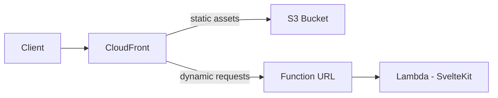

# kit-on-lambda

[](https://www.npmjs.com/package/kit-on-lambda)
[](./LICENSE)

SvelteKit adapter for AWS Lambda — deploy to Node.js or Bun runtimes, bundled with esbuild or Bun, behind CloudFront.

By default the construct uses a Lambda Function URL as the CloudFront origin (with response streaming). You can override this with any custom origin via the `toDefaultOrigin` prop — for example, an HTTP API Gateway when you need a Lambda authorizer.

Three build/runtime configurations are supported:

| Option      | Build tool | Lambda runtime     |
| ----------- | ---------- | ------------------ |
| 1 (default) | esbuild    | Node.js            |
| 2           | Bun        | Bun (custom layer) |
| 3           | Bun        | Node.js            |

## Installation

```bash
npm i kit-on-lambda aws-cdk aws-cdk-lib constructs
# or
bun i kit-on-lambda aws-cdk aws-cdk-lib constructs
```

To access the raw AWS event and context from inside your SvelteKit handlers, also install:

```bash
npm i @beesolve/lambda-fetch-api
# or
bun i @beesolve/lambda-fetch-api
```

[`@beesolve/lambda-fetch-api`](https://www.npmjs.com/package/@beesolve/lambda-fetch-api) provides `getAwsEvent()` / `getAwsContext()` backed by `AsyncLocalStorage`.

## Architecture

SvelteKit is deployed to AWS Lambda behind CloudFront. Static assets are served from an S3 bucket.


```mermaid
graph LR
    Client --> CloudFront
    CloudFront -->|static assets| S3[S3 Bucket]
    CloudFront -->|dynamic requests| FnUrl[Function URL]
    FnUrl --> Lambda[Lambda - SvelteKit]
```

## Local development

The adapter only affects the **build/deploy** output. Locally you run the app as a
normal SvelteKit project with Vite — there is no Lambda, CloudFront, or S3 involved:

```bash
bun run dev        # or: npm run dev / vite dev
```

If you use Bun and load env vars from a file, wire it into the `dev` script so it is
applied automatically:

```json
{
  "scripts": {
    "dev": "bun --env-file=.env.local vite dev"
  }
}
```

### The AWS event/context is not available under `vite dev`

`getAwsEvent()` / `getAwsContext()` (from
[`@beesolve/lambda-fetch-api`](https://www.npmjs.com/package/@beesolve/lambda-fetch-api))
are backed by an `AsyncLocalStorage` store that is only populated **inside a real
Lambda invocation** (via `runWithAwsContext` in the adapter's handler). Under
`vite dev` there is no invocation, so calling them throws
`NotInHandlerContextError: getAws* called outside of a handler invocation.`

Guard any code that reads them so it has a local fallback. `import.meta.env.DEV` is
`true` under `vite dev` and compiled out of the production build:

```ts
// hooks.server.ts
import { getAwsEvent } from "@beesolve/lambda-fetch-api";

export const handle: Handle = async ({ event, resolve }) => {
  if (import.meta.env.DEV) {
    // Local dev: no Lambda context — inject whatever the app needs.
    event.locals.session = devSession;
  } else {
    const awsEvent = getAwsEvent(); // safe: only runs inside a real invocation
    // ...derive locals from the authorizer/event...
  }
  return resolve(event);
};
```

Services that build on this adapter often expose a dev fallback so you do not have to
write this yourself — e.g. [`@beesolve/auth-service`](https://www.npmjs.com/package/@beesolve/auth-service)'s
`createSessionHandle({ fallbackSession })` injects a session automatically when not
running in Lambda.

## Option 1 — build with esbuild, run on Node.js runtime

The default adapter. Uses esbuild to bundle the server and deploys to the official Node.js Lambda runtime.

```ts
// svelte.config.js
import { vitePreprocess } from "@sveltejs/vite-plugin-svelte";
import adapter from "kit-on-lambda";

const originUrl = "https://{distributionId}.cloudfront.net";

/** @type {import('@sveltejs/kit').Config} */
const config = {
  preprocess: vitePreprocess(),
  kit: {
    adapter: adapter(),
    paths: {
      assets: originUrl,
    },
    csrf: {
      trustedOrigins: [originUrl],
    },
  },
};

export default config;
```

> [!NOTE]
> Set `kit.paths.assets` and `kit.csrf.trustedOrigins` to your CloudFront distribution URL.

```ts
// app.ts
import { SvelteKit } from "kit-on-lambda/cdk";
import { App, Stack, type Environment } from "aws-cdk-lib";

const env: Environment = {
  account: "your-account-id",
  region: "your-preferred-region",
};

const app = new App();
const stack = new Stack(app, "YourSite", { env });

const { handler, distribution } = new SvelteKit(stack, "SvelteKit", {
  runtime: "node",
});
```

Add the CDK script to your `package.json`:

```json
{
  "scripts": {
    "dev": "vite dev",
    "build": "vite build",
    "cdk": "cdk --app \"node --experimental-strip-types app.ts\" --profile {your-aws-profile}"
  }
}
```

If you are using `bun` instead of `node`:

```json
{
  "scripts": {
    "dev": "bun run --bun --env-file=./.env vite dev",
    "build": "bunx --bun vite build",
    "cdk": "cdk --app \"bun app.ts\" --profile {your-aws-profile}"
  }
}
```

Deploy:

```bash
bun run build
bun run cdk bootstrap  # only needed the first time
bun run cdk deploy
```

By default the Lambda uses `InvokeMode.RESPONSE_STREAM`. To use buffered responses:

```ts
const { handler, distribution } = new SvelteKit(stack, "SvelteKit", {
  runtime: "node",
  invokeMode: InvokeMode.BUFFERED,
});
```

### Accessing the AWS event and context (Node.js runtime)

Install [`@beesolve/lambda-fetch-api`](https://www.npmjs.com/package/@beesolve/lambda-fetch-api) and use `getAwsEvent()` / `getAwsContext()` from anywhere inside a request handler. These are backed by `AsyncLocalStorage` — no request argument needed.

```ts
// hooks.server.ts
import type { Handle } from "@sveltejs/kit";
import {
  getAwsContext,
  getAwsEvent,
  isAPIGatewayProxyEvent,
  isAPIGatewayProxyEventV2,
} from "@beesolve/lambda-fetch-api";

export const handle: Handle = async ({ event, resolve }) => {
  const awsEvent = getAwsEvent();
  const awsContext = getAwsContext();

  if (isAPIGatewayProxyEvent(awsEvent)) {
    // API Gateway v1 (REST API)
  }
  if (isAPIGatewayProxyEventV2(awsEvent)) {
    // API Gateway v2 / Function URL
  }

  awsContext.getRemainingTimeInMillis();

  return await resolve(event);
};
```

## Option 2 — build with Bun, run on Bun runtime

Uses Bun to bundle the server and deploys to a custom Bun Lambda runtime via [`@beesolve/lambda-bun-runtime`](https://www.npmjs.com/package/@beesolve/lambda-bun-runtime).

```ts
// svelte.config.js
import { vitePreprocess } from "@sveltejs/vite-plugin-svelte";
import adapter from "kit-on-lambda/bun";

const originUrl = "https://{distributionId}.cloudfront.net";

/** @type {import('@sveltejs/kit').Config} */
const config = {
  preprocess: vitePreprocess(),
  kit: {
    adapter: adapter({ runtime: "bun" }),
    paths: {
      assets: originUrl,
    },
    csrf: {
      trustedOrigins: [originUrl],
    },
  },
};

export default config;
```

```ts
// app.ts
import { SvelteKit } from "kit-on-lambda/cdk";
import { App, Stack, type Environment } from "aws-cdk-lib";

const app = new App();
const stack = new Stack(app, "YourSite", {
  env: { account: "your-account-id", region: "your-preferred-region" },
});

const { handler, distribution } = new SvelteKit(stack, "SvelteKit", {
  runtime: "bun",
});
```

By default the Lambda uses `InvokeMode.RESPONSE_STREAM`. To use buffered responses:

```ts
const { handler, distribution } = new SvelteKit(stack, "SvelteKit", {
  runtime: "bun",
  invokeMode: InvokeMode.BUFFERED,
});
```

## Option 3 — build with Bun, run on Node.js runtime

Uses Bun as the bundler but targets the official Node.js Lambda runtime. Useful when you want Bun's faster build times without requiring a custom Lambda layer.

```ts
// svelte.config.js
import { vitePreprocess } from "@sveltejs/vite-plugin-svelte";
import adapter from "kit-on-lambda/bun";

const originUrl = "https://{distributionId}.cloudfront.net";

/** @type {import('@sveltejs/kit').Config} */
const config = {
  preprocess: vitePreprocess(),
  kit: {
    adapter: adapter({ runtime: "node" }),
    paths: {
      assets: originUrl,
    },
    csrf: {
      trustedOrigins: [originUrl],
    },
  },
};

export default config;
```

```ts
// app.ts
import { SvelteKit } from "kit-on-lambda/cdk";
import { App, Stack, type Environment } from "aws-cdk-lib";

const app = new App();
const stack = new Stack(app, "YourSite", {
  env: { account: "your-account-id", region: "your-preferred-region" },
});

const { handler, distribution } = new SvelteKit(stack, "SvelteKit", {
  runtime: "node",
});
```

## Custom origins with `toDefaultOrigin`

The `SvelteKit` construct uses a Function URL as the CloudFront origin by default. You can replace it with any origin by providing a `toDefaultOrigin` factory function.

### HTTP API Gateway origin

Use this when you need a Lambda authorizer at the gateway level (e.g., for session validation). Response streaming is not available with HTTP API Gateway — the Lambda always uses the buffered handler.

```ts
// app.ts
import { SvelteKit } from "kit-on-lambda/cdk";
import { App, Stack, type Environment } from "aws-cdk-lib";
import { InvokeMode } from "aws-cdk-lib/aws-lambda";
import { HttpApi, HttpMethod } from "aws-cdk-lib/aws-apigatewayv2";
import { HttpLambdaIntegration } from "aws-cdk-lib/aws-apigatewayv2-integrations";
import { HttpOrigin } from "aws-cdk-lib/aws-cloudfront-origins";

const app = new App();
const stack = new Stack(app, "YourSite", {
  env: { account: "your-account-id", region: "your-preferred-region" },
});

const api = new HttpApi(stack, "Api");

const { handler, distribution } = new SvelteKit(stack, "SvelteKit", {
  runtime: "node",
  invokeMode: InvokeMode.BUFFERED,
  toDefaultOrigin: ({ handler }) => {
    const integration = new HttpLambdaIntegration("Integration", handler);

    api.addRoutes({
      path: "/{proxy+}",
      methods: [HttpMethod.ANY],
      integration,
    });
    api.addRoutes({
      path: "/",
      methods: [HttpMethod.ANY],
      integration,
    });

    const apiUrl = new URL(api.apiEndpoint);
    return new HttpOrigin(apiUrl.hostname);
  },
});
```

### With a service that manages the authorizer

When using [`@beesolve/auth-service`](https://www.npmjs.com/package/@beesolve/auth-service), the service manages the HTTP API Gateway, Lambda authorizer, and CloudFront behaviors. See the [auth-service CDK documentation](https://github.com/beesolve/packages/tree/main/packages/service-auth#cdk-setup) for full integration examples with `kit-on-lambda`.

The construct exposes:

- `handler` — the Lambda function.
- `distribution` — the CloudFront distribution.

## Troubleshooting

### SvelteKit named form actions — `?/actionName` query parameter

AWS (both Function URL and API Gateway) does not allow unencoded `/` in query parameter values. SvelteKit's named form actions use `?/actionName` as the query string, which gets rejected or mangled.

**Workaround:** encode the action parameter in your forms and hooks so the slash is sent as `%2F`.

Tracked upstream: [sveltejs/kit#15610](https://github.com/sveltejs/kit/issues/15610)

## Thank you

This package has been inspired by various other libraries. Some code has been adapted from:

- [sveltekit-adapter-aws-base](https://github.com/Data-Only-Greater/sveltekit-adapter-aws-base)
- [nitro aws-lambda preset](https://github.com/nitrojs/nitro/tree/main/src/presets/aws-lambda)
